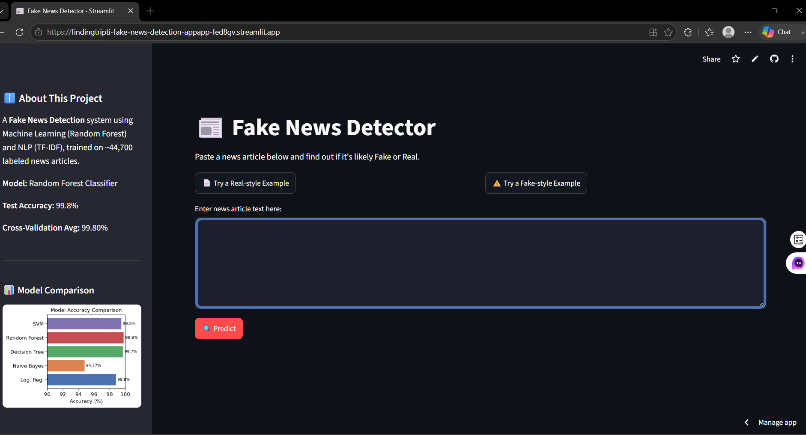
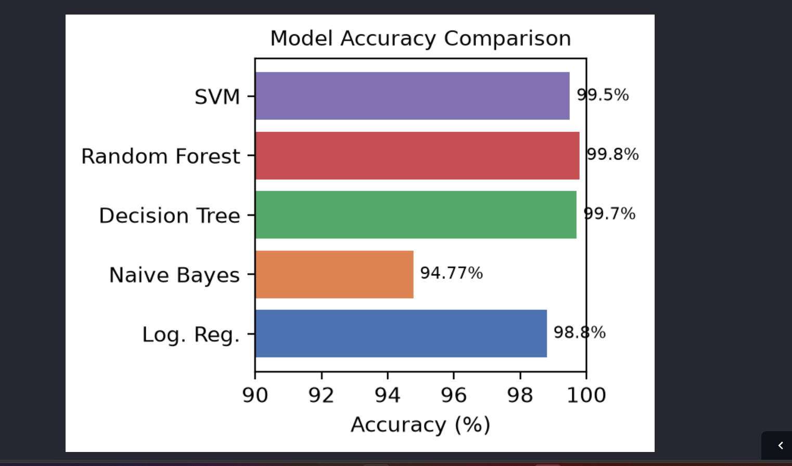

# 📰 Fake News Detection using Machine Learning & NLP

<div align="center">


**A Machine Learning & NLP based Fake News Detection System that classifies news articles as Fake or Real using multiple supervised learning algorithms.**

</div>

---

# 📌 Overview

Fake news spreads rapidly across social media and online platforms. This project uses **Natural Language Processing (NLP)** and **Machine Learning** to automatically classify news articles as **Fake** or **Real**.

The application preprocesses textual data, extracts features using **TF-IDF Vectorization**, compares multiple machine learning models, selects the best-performing classifier, and deploys the model through an interactive **Streamlit** web application.

---

# ✨ Features

- Detect Fake or Real news articles
- NLP preprocessing pipeline
- TF-IDF feature extraction
- Trained and compared 5 Machine Learning models
- Interactive Streamlit web application
- Prediction confidence score
- Built-in sample news articles
- Model comparison visualization

---

# 📂 Dataset

**Dataset:** Kaggle Fake and Real News Dataset

- Approximately **44,700** labeled news articles
- Fake News → **0**
- Real News → **1**

---

# 🧠 Machine Learning Models

The following classifiers were trained and evaluated:

| Model | Accuracy |
|--------|----------|
| Logistic Regression | 98.8% |
| Naive Bayes | 94.77% |
| Decision Tree | 99.7% |
| **Random Forest ⭐** | **99.8%** |
| Support Vector Machine (SVM) | 99.5% |

### 🏆 Best Performing Model

**Random Forest Classifier**

- Test Accuracy: **99.8%**
- Cross Validation Accuracy: **99.8%**

---

# ⚙️ NLP Pipeline

The text preprocessing pipeline includes:

- Convert text to lowercase
- Remove HTML tags
- Remove URLs
- Remove punctuation
- Remove numbers
- Remove stop words
- Tokenization
- Lemmatization
- TF-IDF Vectorization

---

# 🔄 Project Workflow

```text
Raw Dataset
     │
     ▼
Data Loading
     │
     ▼
Merge Fake & Real News
     │
     ▼
Shuffle Dataset
     │
     ▼
Data Cleaning
     │
     ▼
Text Preprocessing
     │
     ▼
TF-IDF Vectorization
     │
     ▼
Train ML Models
     │
     ▼
Model Evaluation
     │
     ▼
Best Model Selection
     │
     ▼
Streamlit Web App
```

---

# 🛠 Tech Stack

### Programming Language

- Python

### Libraries

- Pandas
- NumPy
- Scikit-learn
- NLTK
- Streamlit
- Joblib
- Matplotlib

---

# 📁 Project Structure

```text
fake-news-detection/
│
├── app/
│   └── app.py
│
├── data/
│   ├── raw/
│   │   ├── Fake.csv
│   │   └── True.csv
│   │
│   └── processed/
│       └── cleaned_news_data.csv
│
├── models/
│   ├── fake_news_model.pkl
│   └── tfidf_vectorizer.pkl
│
├── notebooks/
│   └── 01_preprocessing.ipynb
│
├── requirements.txt
├── README.md
└── .gitignore
```

---

# 🚀 Installation

Clone the repository

```bash
git clone https://github.com/findingtripti/fake-news-detection.git
```

Move into the project directory

```bash
cd fake-news-detection
```

Install dependencies

```bash
pip install -r requirements.txt
```

Run the application

```bash
streamlit run app/app.py
```

---

# 💻 Web Application

The Streamlit application allows users to:

- Paste any news article
- Predict whether it is Fake or Real
- View confidence score
- Test with sample news articles
- Compare model performance

---

# 📸 Screenshot

## Home Page



## Model Comparison



# 🤝 Contributing

Contributions are welcome.

1. Fork the repository
2. Create a feature branch
3. Commit your changes
4. Push your branch
5. Open a Pull Request

---

# 👩‍💻 Author

**Tripti**

Machine Learning | NLP | Python | Streamlit

If you found this project useful, consider giving it a ⭐ on GitHub.

---

## ⭐ Project Highlights

- 📊 44,700+ labeled news articles
- 🧠 5 Machine Learning classifiers
- 📝 NLP + TF-IDF feature extraction
- 🏆 Random Forest Accuracy: **99.8%**
- 🌐 Interactive Streamlit Web App
- 📈 Professional project structure